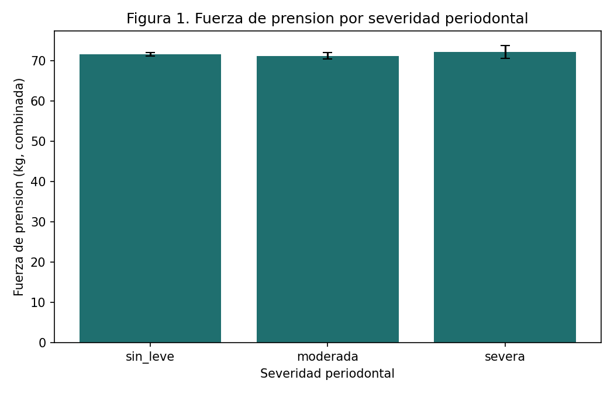
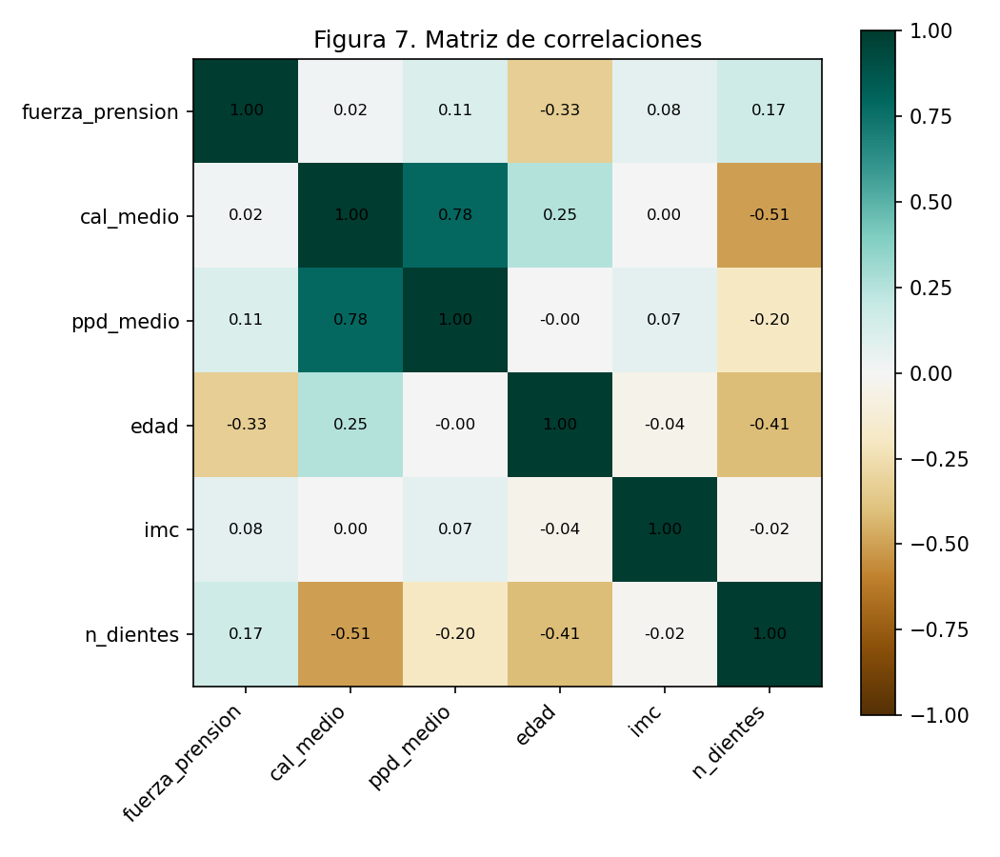
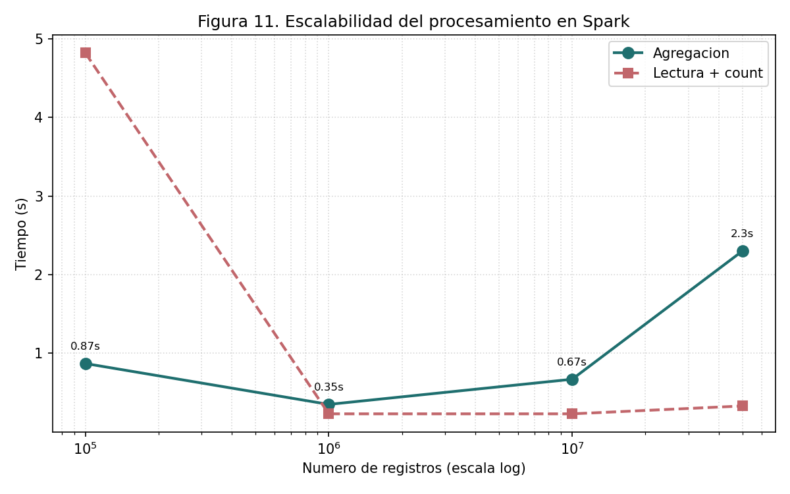

# EDA & Key Findings Summary

Condensed view of the exploratory analysis and results, for readers who want the key figures
and numbers without running the full pipeline. Full methodology and code: see the main
[README](../README.md) and [`scripts/`](../scripts/).

## Sample composition (real data, n=3,389)

Adults ≥30 with both grip strength and periodontal examination recorded in NHANES 2013-2014:
1,729 women, 1,660 men; periodontal severity distribution skewed toward no/mild disease
(2,373 no/mild, 844 moderate, 172 severe), consistent with expected population epidemiology.

## Finding 1 — Crude relationship is misleading

Grip strength by periodontal severity looks flat at first glance:

Crude correlation between attachment loss (CAL) and grip strength: **r = 0.02** — practically
null. This is the finding that motivates the rest of the analysis: a naive read would
conclude "no relationship," which turns out to be wrong once confounders are controlled for.

## Finding 2 — Confounding structure (why the crude correlation is misleading)

The correlation matrix explains what's going on:

Age correlates negatively with grip strength (r = −0.33) and positively with attachment loss
(r = 0.25) — age confounds the periodontal-strength relationship from both sides. Tooth count
(`n_dientes`) correlates negatively with attachment loss (r = −0.51) and positively with grip
strength (r = 0.17), suggesting a distinct nutritional/masticatory pathway.

**Adjusted model** (grip strength ~ periodontal severity + age + sex + BMI): R² = 0.655.
After adjustment, strength is governed primarily by **sex** (−33 kg in women) and **age**
(−0.5 kg/year). The no/mild periodontal group retains a significantly greater strength
(>3 kg, p<0.001) than the moderate group — a real but modest association, once the dominant
confounders are accounted for.

## Finding 3 — Tooth count is a more robust predictor than periodontal severity

Each additional functional tooth was associated with a significant strength increase
(p=0.002, adjusted for age/sex/BMI) — a more robust relationship than periodontal severity
itself, consistent with a nutritional/masticatory pathway rather than periodontal disease
acting directly on muscle.

## Data engineering: scalability validation (synthetic data, up to 50M records)

- Read+count time stays near-constant across scales (Parquet metadata optimization + lazy
  evaluation) — the flat dashed line.
- Aggregation time scales **sub-linearly** with volume (0.87s → 0.35s → 0.67s → 2.3s across
  100K → 1M → 10M → 50M records) — characteristic of a parallelism-exploiting engine, not
  linear degradation.
- Reading the full 50M-record set with **pandas was impossible** (process killed by the OS,
  RAM exhaustion) — the direct empirical motivation for using Spark at this scale.
- Aggregated statistics computed on the 50M synthetic records reproduced the real-data values
  (correlations, group means) to the second decimal place, validating the synthetic
  generation method's fidelity.

## Bottom line

Clinically: the periodontal health–muscle strength relationship is real but weak, and
dominated by age and sex as confounders — functional dentition is a more robust predictor
than periodontal severity per se. From a data engineering standpoint: the same pipeline that
handles 3,389 real records scales, with the same code logic, to 50 million synthetic records
by leveraging Spark's partitioned, lazy-evaluated processing model — while pandas fails
outright at that volume.
